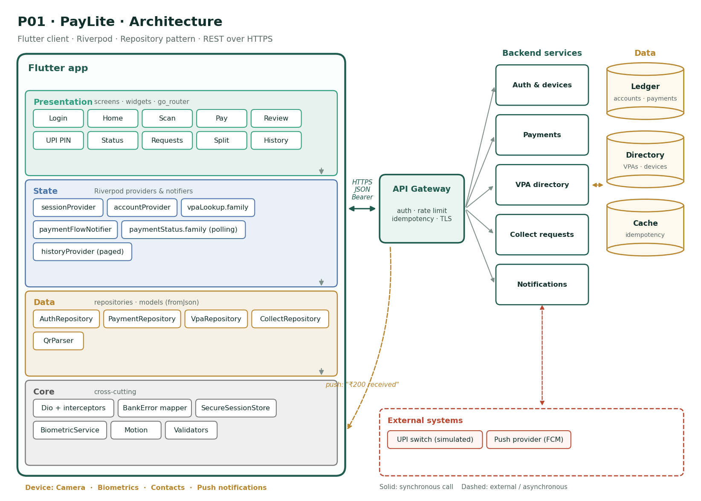

<div align="center">
  
  
  # PayLite 💸

  > **A lightning-fast, highly secure, UPI-style mock payment application built with Flutter & Node.js.**

  [](https://flutter.dev/)
  [](https://nodejs.org/)
  [](LICENSE)
  [](https://github.com/Ambar-Gupta22/paylite/actions)

</div>

---

## 📖 Overview

**PayLite** is a feature-complete person-to-person mobile payment app. It demonstrates modern architecture, state management with Riverpod, offline-first capabilities, and banking-level idempotency to prevent duplicate charges.

It is paired with a custom Node.js Express backend that handles mock UPI transactions, VPA (Virtual Payment Address) verification, and network latency simulations.

## 🏗 Architecture & State Management

PayLite adheres strictly to a **Feature-Driven Architecture** utilizing **Riverpod** for robust, reactive state management. 

<div align="center">
  
</div>

The application is cleanly divided by feature, ensuring high cohesion and low coupling:

```text
lib/
├── app/          # Core configurations (Theme, GoRouter, App Boot)
├── core/         # Shared layer (API client, Error Mappers, Generic UI)
└── features/     # Feature-scoped modules
    ├── auth/     # Login, Sessions, Biometrics
    ├── home/     # Dashboard, Balances
    ├── scan/     # QR Scanning & Parsing
    ├── pay/      # Payment State Machine, Idempotency, VPA Lookup
    ├── collect/  # Incoming Money Requests
    └── history/  # Transaction History & Filtering
```

Each feature adheres to a strict layered structure: `domain/` (Entities), `data/` (Repositories), `state/` (Notifiers), and `presentation/` (Widgets).

## ✨ Key Features

- **🔐 Bank-Grade Security**: Secure storage of tokens, `FLAG_SECURE` window protection to prevent screenshots during PIN entry, and biometric App Lock integration.
- **⚡ Idempotency**: Strict network retry protections. Network timeouts safely generate unique `Idempotency-Keys` guaranteeing a user is never double-charged.
- **📷 QR Scan & Pay**: Integrated scanner that instantly parses `upi://pay` deep links and transitions the state machine.
- **🔄 Real-time Polling**: Background `Timer` polling that tracks asynchronous banking resolutions (`PENDING` -> `SUCCESS` or `FAILED`).
- **🛡 Robust Error Handling**: Custom `BankError` sealed classes intercept raw `DioExceptions` and map them into user-friendly UI messages without leaking stack traces.
- **🎨 Liquid UI/UX**: Shimmer loading skeletons, animated widget switchers, interactive PIN pads, and dynamic transaction coloring.

---

## 🚀 Getting Started

### 1. Start the Mock Backend (Node.js)

The mock backend acts as the UPI Switch and Bank Ledger.

```bash
cd backend
npm install
npm start
```
*The server will run on `http://localhost:3000`.*

### 2. Run the Flutter Application

Launch the Flutter app and inject the backend URL via environment variables.

```bash
# For Chrome / Web
flutter run -d chrome --dart-define=API_URL=http://localhost:3000

# For Android Emulator
flutter run -d emulator-5554 --dart-define=API_URL=http://10.0.2.2:3000

# For iOS Simulator
flutter run -d "iPhone 15" --dart-define=API_URL=http://127.0.0.1:3000
```

### 3. Test Credentials

The local Node.js database is pre-seeded with the following users:

| Name | Customer ID | UPI ID (VPA) |
|---|---|---|
| **Priya** | `customer001` | `priya@paylite` |
| **Ramesh** | `customer002` | `ramesh@paylite` |
| **Asha** | `customer003` | `asha@paylite` |

🔑 **PIN Setup**: The system accepts **any 4-digit number** (e.g., `1234`) during login and transactions.

---

## 🧪 Testing & CI

PayLite is rigorously tested to ensure financial accuracy.

```bash
# Run unit and state-machine tests
flutter test

# Run End-to-End integration tests
flutter test integration_test/
```

We utilize **GitHub Actions** for Continuous Integration (CI). Every Pull Request automatically triggers `flutter analyze` and `flutter test` to ensure stability before merging.

---

## 🚧 Known Limitations
- "Split Bill" and "Share Receipt" modules are mocked in the UI but pending backend implementation.
- Real biometric hardware fallback (face vs fingerprint) requires testing on physical devices.

---
<div align="center">
  <i>Built with 💙 for the Flutter Capstone Project</i>
</div>
